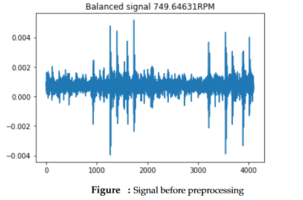
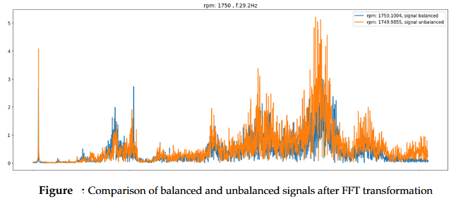
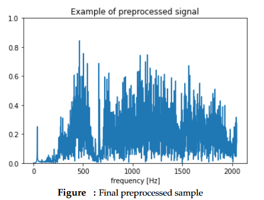
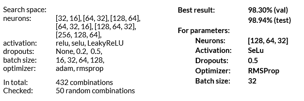
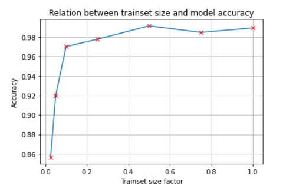
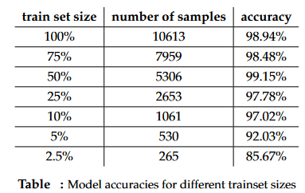
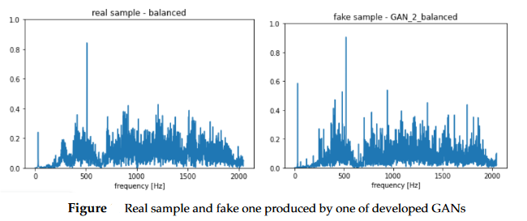

# Data Augmentation of Vibration Signals Dataset with use of GANs

The aim of the project was to research the possibility of vibration signal dataset extension with use of GANs 

## Dataset
The dataset used in this project can be found on Kaggle [[link](https://www.kaggle.com/datasets/jishnukoliyadan/vibration-analysis-on-rotating-shaft)]. It was created by the group of researchers from Fraunhofer Institute for Integrated Circuits Division Engineering of Adaptive Systems in Dresden, Germany, for research which resulted in scientific paper *Machine Learning-Based Unbalance Detection of a Rotating Shaft Using Vibration Data* [[link](https://arxiv.org/pdf/2005.12742.pdf)]. The dataset contains signals gathered by measurements of vibration on a rotating shaft with a specific imbalance or without any imbalance. In experiment 4 different imbalances were used, therefore the subsets containing each category were signed with numbers from 0 to 4, where 0 means no imbalance and 4 is the biggest one. Each subset was also divided into development (training) and evaluation (test) subsets.
In this project, only part of the original dataset was used - a pair of subsets 0 and 2 (no imbalance and medium imbalance), which were then used in the classification problem. After merging these subsets the final dataset consisted of:
- 12 872 samples - training subset,
- 3340 samples - test subset.

Each signal was 1s long with a samplerate of 4096.

## Project Plan
1. Preprocess data,
2. Perform hyperparameter optimization on full dataset to find optimal parameters of the classifier,
3. Analyse the impact of training set size on the model performance,
4. Reduce dataset and train several GANs on it,
5. Evaluate performance of the main classifier trained on reduced dataset augmented with use of GANs trained before

## Data Preprocessing
The vibration signal in its original form is a timeseries, therefore it requires certain preprocessing steps before being fed to a classic Neural Network. Following the method presented by the scientists in the original research on this dataset, Fast Fourier Transform was performed on each of the signals. Then the FFT data was scaled by subtracting from each Fourier coefficient the respective median and dividing by the interquantile range between quantiles 5 and 95

Additionally, the data was finally normalised to the range [0,1], so that it can be reproduced by the generator with *sigmoid* activation function at the output layer (for *tanh* output activation function it can be easily scaled). The final preprocessed sample is a vector with length of 2048.

The test set was scaled and normalised with the same parameters (for scaling medians and interquantile ranges, for normalization minimums and maximums) as the training set. Finally, part of the training subset was taken away as a validation subset.

## Building Main Classifier - Hyperparameter Optimization
The Main Classifier hyperparameter optimization was conducted using Randomised Search. 

## Analysis of the impact of training set size on the model performance

We see that the model has really high accuracy (>97%) for really big training dataset reductions, the accuracy falls below 95% for the first time when only 5% of data is used. Therefore the reduced dataset with only 530 samples (5% of the original dataset) will be used in further research.

## GANs Development
The original dataset consists of 2 classes: balanced and unbalanced signals. Therefore the decision was made to develop GANs in pairs. Each pair would consist of GANs producing samples of each class. This method required separating the dataset with respect to the sample’s class. In process of developing GANs several parameters and training methods were checked:
- numbers of layers for Discriminator and Generator (usually 1 or 2),
- numbers of iterations,
- different activation functions at Generator’s output (sigmoid or tanh),
- training disproportions, for example in case Discriminator is doing to well - 2 training iterations of Generator per 1 of Discriminator, and vice versa.

The decision about finishing/continuing training or altering some of the parameters was based on the visual assessment of generated samples. At the end of each training, the set of samples was generated and visualised on the graph.

## Results
| model id | gen layers | disc layers | gen output activation | accuracy |                                                    comment                                                    |
|:--------:|:----------:|:-----------:|:---------------------:|:--------:|:-------------------------------------------------------------------------------------------------------------:|
| baseline |  -         |  -          |  -                    |   92.06% | Model trained on reduced dataset without data augmentation                                                    |
|        1 |          1 |           2 | sigmoid               |   94.78% | trained for 40 000 iterations                                                                                 |
|        2 |          2 |           2 | sigmoid               |   94.02% | trained for 40 000 iterations, mode collapses observed                                                        |
|        3 |          1 |           2 | sigmoid               |   96.12% |  After 10000 training iterations another 20000 with 2 training iterations of generator per 1 of discriminator |
|        4 |          2 |           2 | sigmoid               |   94.56% |  30000 training iterations with 2 training iterations of generator per 1 of discriminator                     |
|        5 |          1 |           2 | tanh                  |   89.01% | 40000 iterations, mode collapse observed                                                                      |
|        6 |          1 |           2 | tanh                  |   95.56% | 30000 training iterations with 3 training iterations of generator per 1 of discriminator                      |
|        7 |          1 |           2 | tanh                  |   90.92% | 20000 training iterations with 5 training iterations of generator per 1 of discriminatorg                     |

Several GANs were developed and saved for later evaluation. The quality of the GANs were measured by accuracy of the main classifier trained on a reduced dataset (5% of original data) augmented with 3000 fake samples produced by developed Generators (50/50 of each label). The results together with GAN’s parameters and additional training information are gathered in table. The best GAN (nb.3) produced fake samples that improved the main classifier’s accuracy from approx. 92% to approx. 96%, which in terms of accuracy error is approx. 50% reduction (from 8% error to 4%). Therefore, we can assume that the main goal of the project - improving the accuracy of the main classifier with GAN-augmented data, was achieved. However, if we take a look back at tab.1, we can see that the model trained on 10% of original data was doing better than the model trained on fake samples. Therefore we can clearly see that real data brings much better results and usually gathering more real-life data might be less expensive and time-consuming than developing GAN that can reproduce these samples well enough